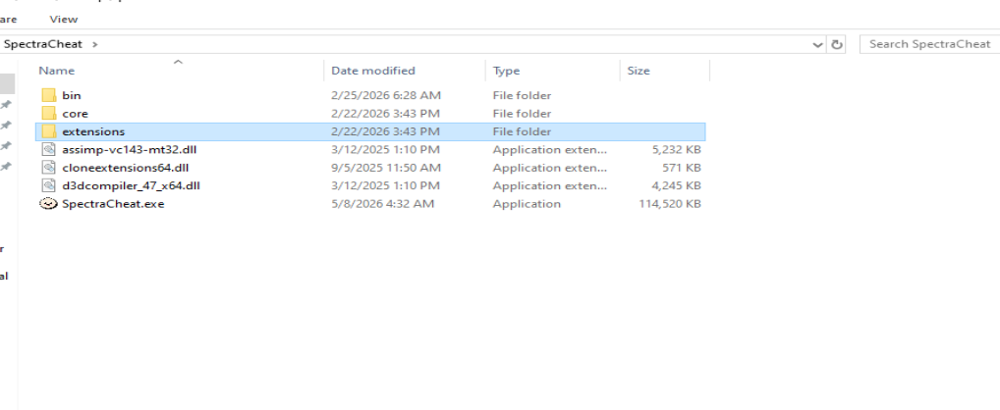
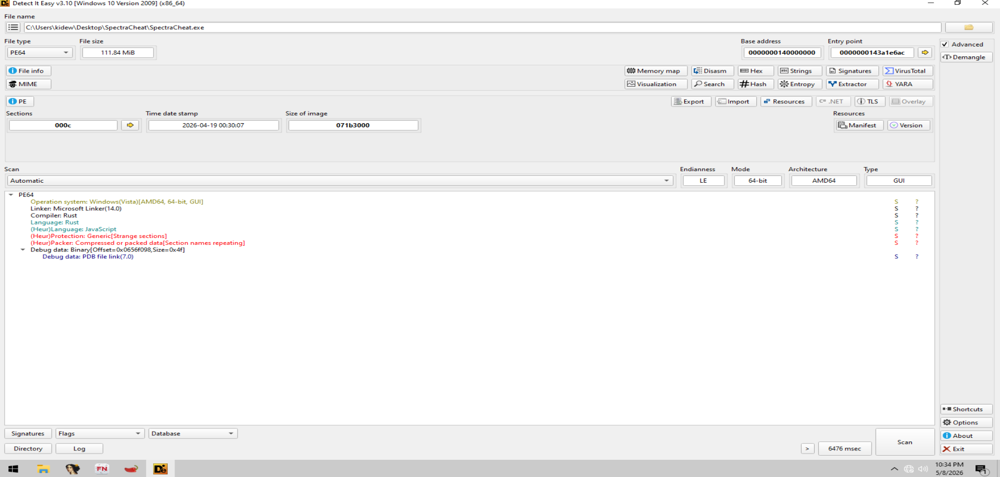
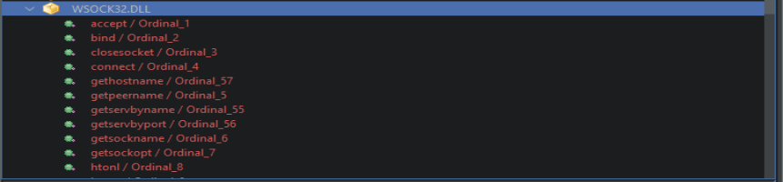
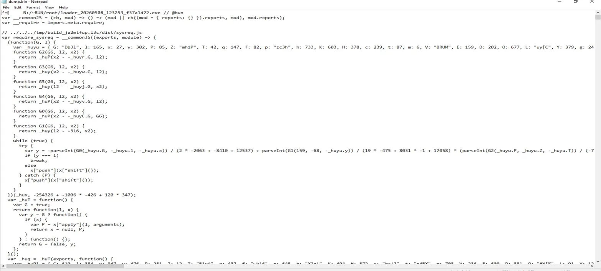
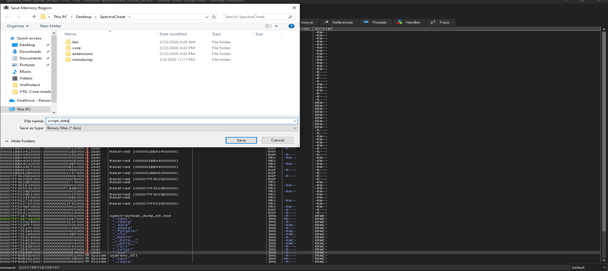
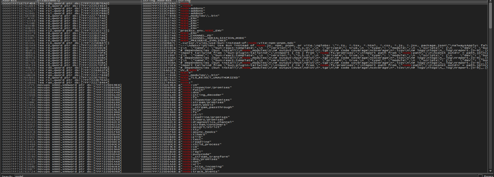
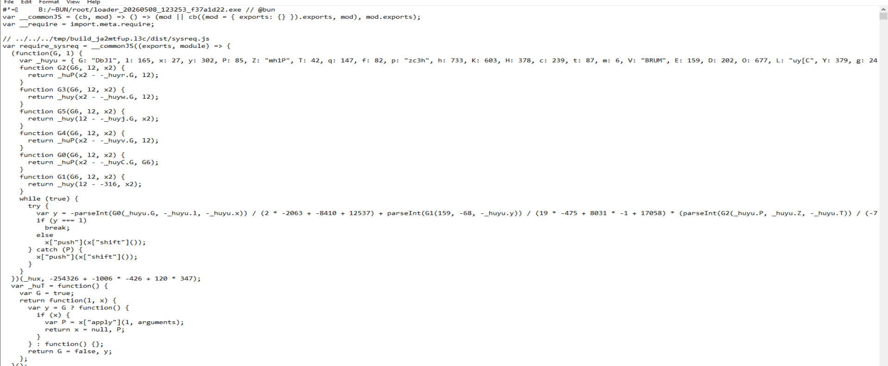
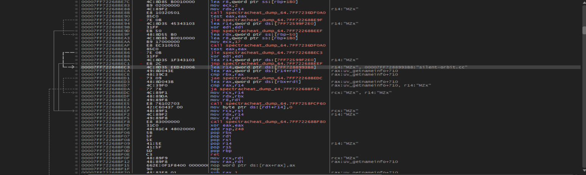
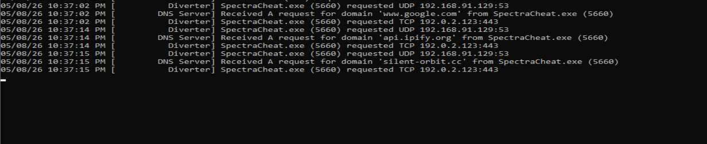
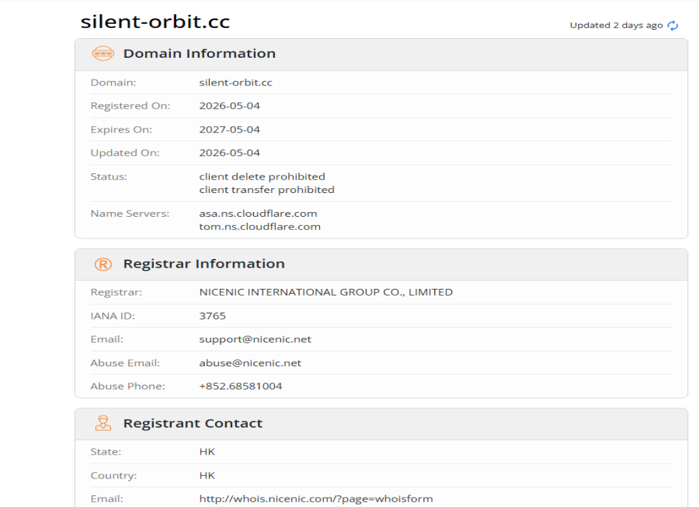

# SpectraCheat.exe — TROJAN

**Date:** 2026-05-08

**Sample:** SpectraCheat.exe

**Distribution:** (SpectraCheat.zip, 186.50 MB, uploaded yesterday at 15:36)

**Analyst:** dd1d3 

---

## Summary

SpectraCheat.exe is distributed as a fake game cheat through a file-sharing page on. The archive (SpectraCheat.zip, ~186 MB) contains the main executable alongside a set of legitimate-looking DLLs used as cover. The executable embeds a Bun JavaScript runtime and obfuscated JS payload that communicates with a freshly registered C2 domain, silent-orbit.cc.

---

## Distribution

SpectraCheat.zip (186.50 MB). The file-sharing page offered no description beyond the filename. The zip contained:


```
SpectraCheat/
  bin/
  core/
  extensions/
  assimp-vc143-mt32.dll
  cloneextensions64.dll
  d3dcompiler_47_x64.dll
  SpectraCheat.exe        (114,520 KB, dated 5/8/2026 4:32 AM)
```

The DLLs are dated 2025 and appear to be legitimate redistributable files used to pad the archive and create the appearance of a real application.



---

## Static Analysis

### DIE Results

Detect It Easy identified the following:

- File type: PE64, GUI
- Compiler: Rust
- Linker: Microsoft Linker 14.0
- Language (heuristic): JavaScript
- Protection (heuristic): Generic — Strange sections
- Packer (heuristic): Compressed or packed data, section names repeating
- Time date stamp: 2026-04-19 00:30:07
- File size: 111.84 MiB
- Sections: 000c (12 sections)

The presence of both Rust and JavaScript heuristics, combined with the `.bun` section visible in the memory map, confirms this is a Bun standalone executable — a Rust-based loader that embeds and executes a JavaScript bundle at runtime.



### PE Sections

The PE viewer shows 12 sections with notably large sizes. Section names include standard ones alongside `.bun` and `__DATA__`, consistent with a Bun-compiled binary. The import table includes standard system DLLs plus WSOCK32.DLL with a full socket API imported: `accept`, `bind`, `closesocket`, `connect`, `gethostname`, `getpeername`, `getservbyname`, `getservbyport`, `getsockname`, `getsockopt`, `htonl`.



### Imports

The symbol tree shows the following DLLs imported: ADVAPI32, BCRYPT, CRYPT32, DBGHELP, IPHLPAPI, KERNEL32, NTDLL, OLE32, SHELL32, USER32, USERENV, WINMM, WS2\_32, WSOCK32. The combination of CRYPT32, BCRYPT, and the full WSOCK32 socket set indicates network communication with encryption capability.


---

## Memory Dump and Embedded JS

During dynamic analysis the `.bun` memory region was dumped using x64dbg (saved as `script_data.bin`). The dump begins with the Bun bundle header:

```
#![] B:/~BUN/root/loader_20260508_123253_f37a1d22.exe // @bun
var __commonJS = (cb, mod) => () => (mod || cb((mod = { exports: {} }).exports, mod), mod.exports);
var __require = import.meta.require;
```

The build path `loader_20260508_123253_f37a1d22.exe` confirms the bundle was compiled on 2026-05-08, the same day the sample appeared on the distribution page.

The bundle contains at least three modules:

- `dist/sysreq.js` — obfuscated, handles system reconnaissance
- `dist/memload.js` — name suggests in-memory loading
- `dist/entry.js` — entry point, calls `require_sysreq()`, `require_memload()`, `require_main()`






### JS Obfuscation

The JS payload uses obfuscator.io-style obfuscation with the following techniques:

**String array rotation** via a `while(true)` loop:
```js
while (true) {
  try {
    var y = -parseInt(G0(_huyu.G, _huyu.l, _huyu.x)) / (2 * -2063 + -8410 + 12537) + ...
    if (y === 1) break;
    else x["push"](x["shift"]());
  } catch (P) {
    x["push"](x["shift"]());
  }
}
```

**Arithmetic obfuscation** of indices through a constants object (`_huyu`) and a set of decode functions (`G0`–`G5`) that wrap `_huP` and `_huy`.

**Bracket notation** throughout: `x["push"]`, `x["shift"]`, `G["CHzJE"]`, `G["QZDOH"]`.

The string array itself (`_hux`) was passed as an argument to the outer IIFE and contained the encoded strings used across all decode calls.



### C2 Domain in Disassembly

In the x64dbg disassembly of the dumped binary, the string `"silent-orbit.cc"` was found in a register annotation at address `00007FF72B8993B8`, referenced during a `lea r14` instruction:

```
lea r14, qword ptr ds:[7FF72B8993B8]   ; r14:"MZx", 00007FF72B8993B8:"silent-orbit.cc"
```

This string was loaded before a sequence of calls consistent with DNS resolution and socket connection.



---

## FakeNet-Ng Analysis


```
SpectraCheat.exe (5660) requested UDP 192.168.91.129:53
DNS Server: Received A request for domain 'www.google.com' from SpectraCheat.exe (5660)
SpectraCheat.exe (5660) requested TCP 192.0.2.123:443
SpectraCheat.exe (5660) requested UDP 192.168.91.129:53
DNS Server: Received A request for domain 'api.ipify.org' from SpectraCheat.exe (5660)
SpectraCheat.exe (5660) requested TCP 192.0.2.123:443
SpectraCheat.exe (5660) requested UDP 192.168.91.129:53
DNS Server: Received A request for domain 'silent-orbit.cc' from SpectraCheat.exe (5660)
SpectraCheat.exe (5660) requested TCP 192.0.2.123:443

```

The execution sequence shows:

1. Checking the connection via `www.google.com`
2. Obtaining public IP addresses via `api.ipify.org`
3. Sending a C2 beacon to `silent-orbit.cc` via TCP/443


---

## C2 Infrastructure

**Domain:** silent-orbit.cc
**Registered:** 2026-05-04 (4 days before sample appearance)
**Expires:** 2027-05-04
**Registrar:** NICENIC INTERNATIONAL GROUP CO., LIMITED (IANA 3765)
**Abuse contact:** abuse@nicenic.net
**Name servers:** asa.ns.cloudflare.com / tom.ns.cloudflare.com
**Registrant:** HK (Hongkong, privacy protected)

The domain was registered 4 days before the sample was uploaded to the distribution page. Cloudflare NS conceals the origin IP. NICENIC is a Chinese registrar frequently observed in malware campaigns due to low cost and minimal identity verification.



---

## IOCs

| Type    | Value                                      |
|---------|--------------------------------------------|
| Domain  | silent-orbit.cc                            |
| Domain  | api.ipify.org (used for IP enumeration)    |
| URL     | https://orbit.cc/lander                    |
| File    | SpectraCheat.exe (114,520 KB)              |
| Archive | SpectraCheat.zip (186.50 MB)               |
| Source  | getballoonfiles.com                        |
| Port    | TCP/443 (C2 communication)                 |
| Hash    | SHA256: 3facab9dcf85e97c76ec418c5a6bb89e73225f45b5ba238c2439b21f34c661e6 (PE header region) |

---

## Disclosure

- Abuse reported to: abuse@nicenic.net
- Domain reported via: Cloudflare abuse
